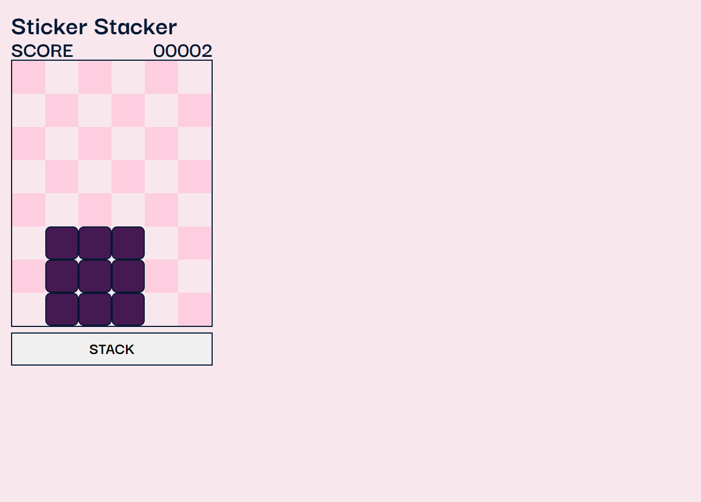
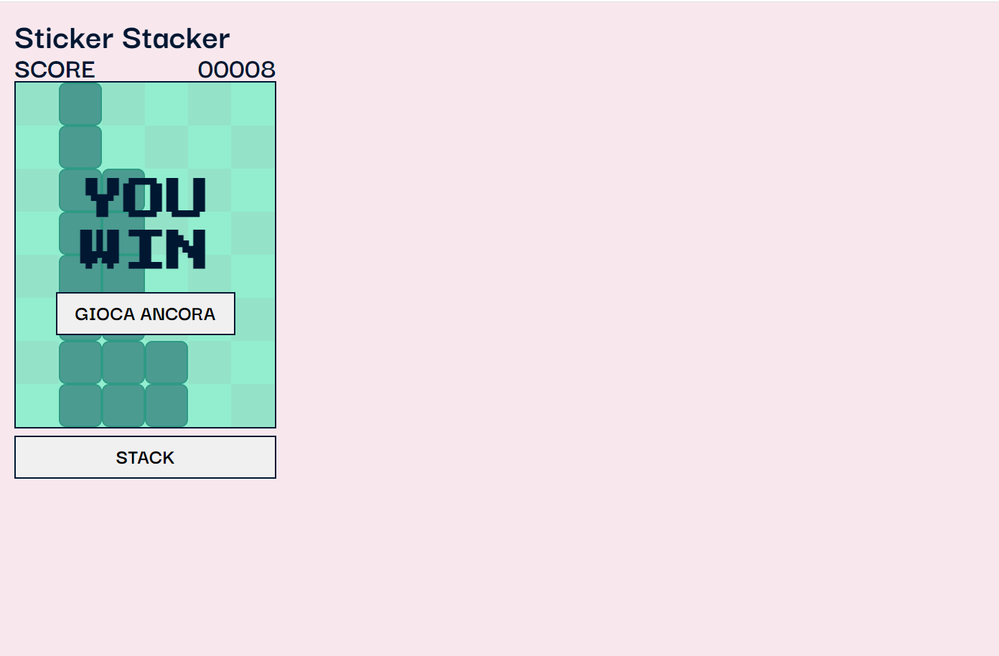
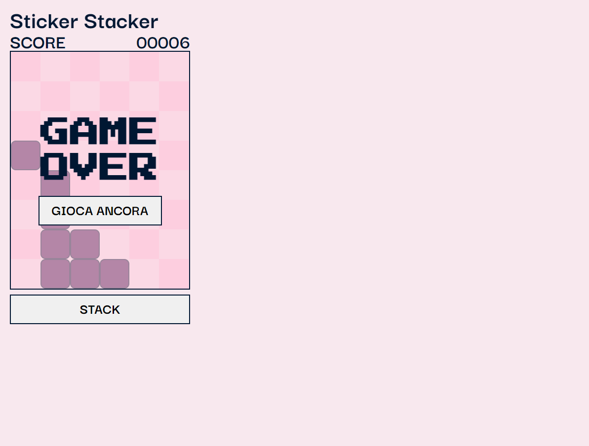

# E-commerce Web App 

Questo progetto è stato realizzando prendendo spunto dal gioco sticker stacker.

## Descrizione

Questo gioco è stato sviluppato con html css e javascript. L'utente avrà un'esperienza divertente. Lo score si aggiorna.

## Funzionalità

Il gioco include le seguenti funzionalità:

-Mattoncini che si muovono a destra e a sinistra
-Score che si aggiorna
-schermata hai vinto
-schermata hai perso

## Tecnologie utilizzate

La web app è stata sviluppata utilizzando le seguenti tecnologie:

- HTML
- CSS
- JavaScript

## Licenza

<!-- Questo progetto è stato rilasciato sotto la licenza MIT. Per ulteriori informazioni, leggere il file `LICENSE.md`. -->

## Crediti

Questo progetto è stato sviluppato da Katia Falletti.(https://it.linkedin.com/in/katia-falletti-616890225?trk=people-guest_people_search-card)
